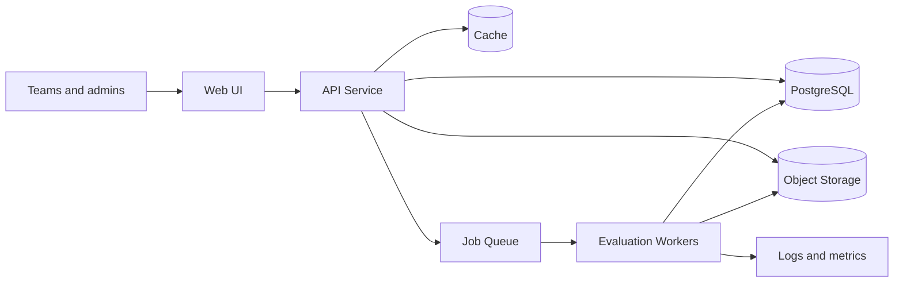

# System Architecture

## Architecture approach

Axon uses a modular service architecture with a stateless API and background evaluation workers. Interactive traffic is separated from long-running evaluation jobs to keep the user experience responsive.

## Core components

- Web UI for teams, evaluators, and admins
- API service for auth, submissions, and leaderboard access
- Evaluation workers that run containerized models
- Job queue for scheduling evaluations
- PostgreSQL database for core metadata
- Object storage for datasets and model artifacts
- Cache layer for dashboard and leaderboard reads
- Observability stack for logs, metrics, and audit trails

## Data flow

