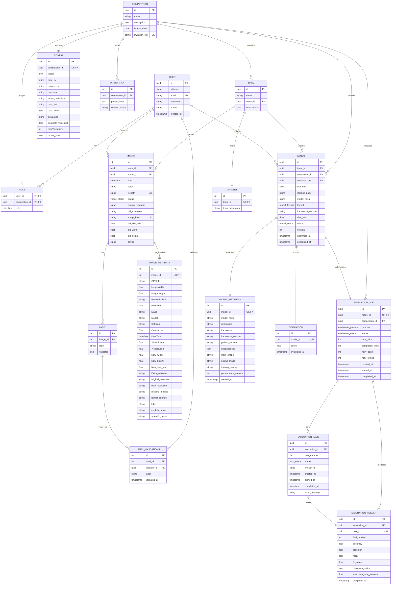

# Data Layer

## Database Schema

### DBML Database Definition

```dbml
// Use DBML to define your database structure
// Docs: https://dbml.dbdiagram.io/docs
//
// PostgreSQL with UUID primary keys for core entities.
// Config uses UUID PK (not auto-increment integer).
// Integer PKs are used for legacy/detail tables (image, label, etc.).

Table user {
  id uuid [primary key, not null]
  fullname varchar [not null]
  email varchar [unique, not null]
  password varchar [not null]
  phone varchar [null]
  created_at timestamp [default: `now()`]
}

Table role {
  user_id uuid [not null]
  competition_id uuid [not null]
  role role_type [not null]  // enum: host, staff, participant

  indexes {
    (user_id, competition_id) [pk]
  }
}

Table competition {
  id uuid [primary key, not null]
  name varchar [not null]
  description text [null]
  launch_date date [null]
  invitation_link varchar [unique, null]
}

Table config {
  id uuid [primary key, not null]
  competition_id uuid [unique, not null]
  labels json [null]
  data_ex varchar [null]
  scoring_ex varchar [null]
  overview varchar [null]
  terms_conditions varchar [null]
  data_md varchar [null]
  data_format json [null]
  evaluation varchar [null, note: 'protocol: standard | loto | toto']
  duplicate_threshhold float [null]
  maxValidations integer [null]
  model_spec json [null, note: 'Docker submission requirements']
}

Table team {
  id uuid [primary key, not null]
  name varchar [not null]
  comp_id uuid [not null]
  user_emails json [null, note: '{"email": 0|1} — 0=invited/left, 1=joined']

  indexes {
    (name, comp_id) [unique]
  }
}

Table phase_log {
  id integer [primary key, not null, increment]
  competition_id uuid [not null]
  phase_dates json [null, note: 'phase timeline, deadlines, transition_mode, and audit history']
  current_phase varchar [not null]
}

Table image {
  id integer [primary key, not null, increment]
  team_id uuid [not null]
  author_id uuid [not null]
  time timestamp [default: `now()`]
  label varchar [null]
  filepath varchar [unique, not null]
  status image_status [not null, default: 'onhold']  // enum: verified, onhold
  original_filename varchar [null]
  old_extension varchar [null]
  image_hash varchar [unique, not null]
  old_size_mb float [null]
  old_width float [null]
  old_height float [null]
  device varchar [null]
}

Table image_metadata {
  id integer [primary key, not null, increment]
  image_id integer [unique, not null]
  GPSInfo varchar [null]
  ImageWidth float [null]
  ImageLength float [null]
  ResolutionUnit varchar [null]
  ExifOffset float [null]
  Make varchar [null]
  Model varchar [null]
  Software varchar [null]
  Orientation float [null]
  DateTime datetime [null]
  YCbCrPositioning varchar [null]
  XResolution float [null]
  YResolution float [null]
  New_width float [null]
  New_height float [null]
  New_size_mb float [null]
  Extra_subfolder varchar [null]
  original_resolution varchar [null]
  new_resolution varchar [null]
  resizing_method varchar [null]
  format_change varchar [null]
  label varchar [null]
  english_name varchar [null]
  scientific_name varchar [null]
}

Table label {
  id integer [primary key, not null, increment]
  image_id integer [not null]
  label varchar [not null]
  validated bool [not null, default: false]
}

Table label_validations {
  id integer [primary key, not null, increment]
  label_id integer [not null]
  validator_id uuid [not null]
  label varchar [not null]
  validated_at timestamp [default: `now()`]
}

Table dataset {
  id integer [primary key, not null, increment]
  team_id uuid [unique, not null]
  team_folderpath varchar [null]
}

Table model {
  id uuid [primary key, not null]
  team_id uuid [not null]
  competition_id uuid [not null]
  submitted_by uuid [not null]
  filename varchar [not null]
  storage_path varchar [not null, note: 'MinIO key e.g. models/uuid.zip']
  model_hash varchar [not null, note: 'unique enforced at app level, not DB constraint']
  format model_format [not null]  // enum: tensorflow, pytorch, sklearn, keras, onnx
  framework_version varchar [not null]
  size_mb float [not null]
  status model_status [not null, default: 'received']  // enum: received, validated, scheduled, queued, evaluating, completed
  version integer [not null]
  submitted_at timestamp [default: `now()`]
  scheduled_at timestamp [null]
}

Table model_metadata {
  id integer [primary key, not null, increment]
  model_id uuid [unique, not null]
  model_name varchar [not null]
  description varchar [null]
  framework varchar [not null]
  framework_version varchar [null]
  python_version varchar [not null]
  dependencies json [null, note: 'list of package names']
  input_shape varchar [null]
  output_shape varchar [null]
  training_dataset varchar [null]
  performance_metrics json [null]
  created_at timestamp [default: `now()`]
}

Table evaluation {
  id integer [primary key, not null, increment]
  model_id uuid [unique, not null]
  score float [not null, note: 'aggregated final score']
  evaluated_at timestamp [default: `now()`]
}

Table evaluation_job {
  id uuid [primary key, not null]
  model_id uuid [unique, not null]
  competition_id uuid [not null]
  protocol evaluation_protocol [not null]  // enum: standard, loto, toto
  status evaluation_status [default: 'scheduled']  // enum: scheduled, queued, in_progress, completed, failed
  total_folds integer [not null]
  completed_folds integer [default: 0]
  retry_count integer [default: 0]
  max_retries integer [default: 3]
  created_at timestamp [default: `now()`]
  started_at timestamp [null]
  completed_at timestamp [null]
}

Table evaluation_task {
  id uuid [primary key, not null]
  evaluation_id uuid [not null]
  task_number integer [not null, note: 'fold number']
  status task_status [default: 'pending']  // enum: pending, queued, executing, completed, failed
  worker_id varchar [null]
  created_at timestamp [default: `now()`]
  started_at timestamp [null]
  completed_at timestamp [null]
  error_message varchar [null]
}

Table evaluation_result {
  id uuid [primary key, not null]
  evaluation_id uuid [not null]
  task_id uuid [unique, not null]
  fold_number integer [not null]
  accuracy float [not null]
  precision float [not null]
  recall float [not null]
  f1_score float [not null]
  confusion_matrix json [null]
  execution_time_seconds float [null]
  computed_at timestamp [default: `now()`]
}


// --------------------------------
// References
// --------------------------------

// role
Ref: role.user_id - user.id
Ref: role.competition_id > competition.id

// config
Ref: config.competition_id - competition.id

// team
Ref: team.comp_id > competition.id

// phase_log
Ref: phase_log.competition_id > competition.id

// image
Ref: image.team_id > team.id
Ref: image.author_id > user.id

// image_metadata
Ref: image_metadata.image_id - image.id

// label
Ref: label.image_id - image.id

// label_validations
Ref: label_validations.label_id > label.id
Ref: label_validations.validator_id > user.id

// dataset
Ref: dataset.team_id - team.id

// model
Ref: model.team_id - team.id
Ref: model.competition_id > competition.id
Ref: model.submitted_by > user.id

// model_metadata
Ref: model_metadata.model_id - model.id

// evaluation
Ref: evaluation.model_id - model.id

// evaluation_job
Ref: evaluation_job.model_id - model.id
Ref: evaluation_job.competition_id > competition.id

// evaluation_task
Ref: evaluation_task.evaluation_id > evaluation_job.id

// evaluation_result
Ref: evaluation_result.evaluation_id > evaluation_job.id
Ref: evaluation_result.task_id - evaluation_task.id
```

### Core Entities Overview

- **user**: Platform users with authentication credentials (UUID PK)
- **role**: Role-based access control (host, staff, participant) per competition (composite UUID FK PK)
- **competition**: Competition metadata (UUID PK)
- **config**: Detailed competition settings (labels, scoring, evaluation rules, model_spec) — UUID PK, UUID FK to competition
- **team**: Team/participant groups with member list stored as JSON array — UUID PK
- **phase_log**: Phase tracking and transitions for competition lifecycle — Integer PK, UUID FK
- **image**: Agricultural field images with processing metadata — Integer PK, UUID FK to team/user
- **image_metadata**: Detailed EXIF and processing information for images
- **label**: Image labels with validation status
- **label_validations**: Voting records for label validation workflow
- **dataset**: Team dataset organization and storage paths
- **model**: Model submissions with format and status tracking — UUID PK
- **model_metadata**: Extra model metadata (dependencies, IO shapes) — Integer PK, UUID FK
- **evaluation**: Final aggregated evaluation scores — Integer PK, UUID FK
- **evaluation_job**: Evaluation job orchestrating multiple fold tasks — UUID PK
- **evaluation_task**: Individual fold evaluation task — UUID PK
- **evaluation_result**: Per-fold evaluation metrics (accuracy, precision, recall, F1, confusion matrix) — UUID PK

### Relationships

```
user (1) ──→ (N) role
competition (1) ──→ (N) role
competition (1) ──→ (1) config
competition (1) ──→ (N) phase_log
competition (1) ──→ (N) team
competition (1) ──→ (N) model
competition (1) ──→ (N) evaluation_job

team (1) ──→ (N) image
team (1) ──→ (1) dataset
team (1) ──→ (N) model

user (1) ──→ (N) image (as author)
user (1) ──→ (N) label_validations (as validator)
user (1) ──→ (N) model (as submitter)

image (1) ──→ (N) label
image (1) ──→ (1) image_metadata
label (1) ──→ (N) label_validations

model (1) ──→ (1) model_metadata
model (1) ──→ (1) evaluation (final score)
model (1) ──→ (1) evaluation_job

evaluation_job (1) ──→ (N) evaluation_task
evaluation_job (1) ──→ (N) evaluation_result
evaluation_task (1) ──→ (1) evaluation_result
```

### Visual Database Schema (Entity Relationship Diagram)



## Data Sources

### Primary Sources

1. **Mobile App (Field Collection)**
   - Direct image uploads from participants in agricultural environments
   - Captures device metadata (camera model, GPS, sensors) automatically
   - Environmental metadata: weather, soil conditions, growth stage

2. **Web Portal (Model Submissions)**
   - Team model files (PyTorch, TensorFlow)
   - Training logs and model checkpoints
   - Model metadata and hyperparameters


### Data Storage

- **Image Storage**: Cloud blob storage (AWS S3 / Azure Blob) with versioning
- **Database**: PostgreSQL for relational data with ACID compliance
- **Cache**: Redis for leaderboard ranking snapshots
- **Queue**: Message broker (RabbitMQ/Celery) for async evaluation tasks

## Data Pipelines

### 1. Ingestion Pipeline

**Flow**: Field Upload → Validation → Metadata Enrichment → Storage

```
Mobile App
    ↓
[Device Validation]
    ↓
[Metadata Auto-fill]  ← Extract: device_id, location, timestamp
    ↓
[Format Check]        ← Ensure JPEG/PNG, valid resolution
    ↓
[Cloud Storage]       ← S3/Azure with folder: /teams/{team_id}/images/
    ↓
[Database Insert]     ← Create Image record
```

**Frequency**: Real-time as users upload
**SLA**: \<2s for acknowledgment to user

### 2. Transformation Pipeline

**Flow**: Raw Data → Normalization → Standardization → Feature Extraction

```
Raw Images (varied sizes: 1080p, 4K, etc.)
    ↓
[Resize to 224x224]   ← Standard input for training
    ↓
[Color Normalization] ← ImageNet mean/std (if applicable)
    ↓
[Metadata JSON]       ← Extract: {device, location, timestamp, growth_stage}
    ↓
[Catalog Entry]       ← Indexed for rapid retrieval by fold/team
```

**Frequency**: Batch processing nightly or on-demand
**Storage**: Transformed images cached in `/processed/` directory

### 3. Validation Pipeline

**Flow**: Data Quality Checks → Schema Compliance → Business Rules

```
Incoming Data
    ↓
[Metadata Completeness] ← device_info, location, timestamp required
    ↓
[Image Quality]         ← Min resolution: 640x480, max file size: 50MB
    ↓
[Duplicate Detection]   ← Hash-based (MD5) to prevent duplicates
    ↓
[Team Quota Check]      ← Max 10,000 images per team
    ↓
[Pass/Fail Decision]    ↙            ↘
                   [Accept]      [Reject - Log Error]
                       ↓             ↓
                  [Mark Valid]  [Notify User]
```

**Rules**: See Validation Rules section below

### 4. Evaluation Pipeline (Async)

**Flow**: Model Submission → Preparation → Evaluation → Leaderboard Update

```
Model Upload (from team)
    ↓
[Model Validation]      ← Check format, framework compatibility
    ↓
[Environment Setup]     ← Spin up isolated container/VM
    ↓
[Data Preparation]
    ├─ LOTO Protocol: For each fold i, train on all but team i, test on team i
    ├─ TOTO Protocol: Train on single team's data, test on all other teams
    └─ Baseline: Standard train/test split
    ↓
[Model Inference]       ← Generate predictions on test set
    ↓
[Metrics Computation]   ← Accuracy, F1, confusion matrix
    ↓
[Leaderboard Update]    ← Rank teams, cache in Redis
    ↓
[Notification]          ← Alert team via email/UI
```

**Duration**: 5-30 mins per model (depends on dataset size)
**Queue**: Celery tasks dispatched to worker pool

## Validation Rules

### Metadata Validation

| Field | Type | Required | Constraints | Example |
|-------|------|----------|-------------|---------|
| `device_id` | String | ✓ | Predefined list | `iPhone_12_PRO` |
| `latitude` | Float | ✓ | -90 to 90 | `35.7638` |
| `longitude` | Float | ✓ | -180 to 180 | `139.7350` |
| `timestamp` | ISO 8601 | ✓ | Within competition period | `2026-05-03T14:30:00Z` |
| `growth_stage` | Enum | ✓ | `seedling`, `tillering`, `flowering`, `maturity` | `flowering` |
| `notes` | String | ✗ | Max 500 chars | `Morning shot, cloudy` |

### Image Validation

| Criterion | Rule | Action on Failure |
|-----------|------|-------------------|
| Format | JPEG or PNG only | Reject with error message |
| Resolution | Min 640×480, Max 4K | Resize if \>4K; reject if \<640×480 |
| File Size | \≤50 MB | Reject; suggest compression |
| Duplicate | MD5 hash not in database | Reject; notify user |
| Color Space | RGB or RGBA | Convert or reject if unsupported |

### Business Rules

- **Team Quota**: Max 10,000 images per team per competition
- **Submission Deadline**: Models accepted until competition end date
- **Model Size**: \≤500 MB to ensure inference feasibility
- **Evaluation Timeout**: 10 mins per model; abort if exceeded
- **Data Consistency**: No image can be removed after evaluation starts

### Error Handling

**Validation Failures** are logged with:
- Error code (e.g., `METADATA_INCOMPLETE`, `IMAGE_RESOLUTION_LOW`)
- User-friendly message
- Recommended action (retry, reformat, contact support)
- Timestamp and team_id for audit trail

```json
{
  "error_code": "METADATA_INCOMPLETE",
  "message": "Missing device_id. Please specify which camera took this photo.",
  "field": "device_id",
  "timestamp": "2026-05-03T14:35:22Z",
  "team_id": "team_42"
}
```
