# Activity Diagram

This diagram captures the competition workflow shown in the activity PNG under `static/diagrams/diagram.activity.png`.

Read top-to-bottom: the swimlanes group responsibilities (Organizers, Participants, System). Use this page as the canonical, source-controlled diagram for the competition lifecycle — update the Mermaid block here when the process or phases change.

```mermaid
%%{init: {'themeVariables': { 'fontSize':'20px', 'fontFamily':'Inter, Arial, sans-serif' }}}%%
flowchart TD
  start([Start])

  subgraph O[Organizers]
    direction TB
    o1["Register<br/>(Web Version)"]
    o2[Set Configs]
    o3[Create Competition]
    o4[Set Teams]
    o5["Start<br/>Phase-1"]
    o6["Start<br/>Phase-2"]
    o7["Start<br/>Phase-3"]
    o8["Start<br/>Phase-4"]
    o9["Start<br/>Phase-5"]
  end

  subgraph P[Participants]
    direction TB
    p1["Register<br/>(Web Version)"]
    p2["Attempt to Join<br/>Competition"]
    p3["Join<br/>Competition"]
    p4["Register<br/>(Mobile Version)"]
    p5["Capture<br/>Image(s)"]
    p6[Select Label]
    p7["Enter<br/>Manually"]
    p8["Upload<br/>Image"]
    p9["Validate<br/>Labels"]
    p10["Modify<br/>Labels"]
    p11["Export<br/>Dataset"]
    p12["Submit<br/>Model"]
  end

  subgraph S[System]
    direction TB
    s1[Config]
    s2[Link]
    s3["Generate<br/>Link"]
    s4["Confirm<br/>Invite"]
    s5{"Invite<br/>accepted?"}
    s6[Teams]
    s7["Extract<br/>Device<br/>Metadata"]
    s8{"Device name<br/>exists?"}
    s9{"Phase-1<br/>still active?"}
    s10["Data<br/>Cleaning"]
    s11["4D-60<br/>Random<br/>Image Display"]
    s12{"Labels<br/>valid?"}
    s13{"Model structure<br/>respected?"}
    s14["Model<br/>Evaluation"]
    s15["Display<br/>Leaderboard"]
  end

  start --> o1
  start --> p1

  o1 --> o2 --> o3 --> o4 --> o5 --> o6 --> o7 --> o8 --> o9
  o2 -.-> s1
  o4 -.-> s6

  p1 --> p2
  p2 -.-> s2
  s2 -.-> s3 --> s4 --> s5
  s5 -->|Yes| p3
  s5 -->|No| end1([End])

  p3 --> p4
  p4 --> s7 --> p5 --> p6 --> s8
  s8 -->|No| p7 --> p8
  s8 -->|Yes| p8
  p8 --> s9
  s9 -->|No| o6
  s9 -->|Yes| s10 --> o7
  o6 --> s10
  o7 --> s11 --> p9 --> s12

  s12 -->|Invalid| p10 --> p11
  s12 -->|Valid| p11
  p11 --> o8 --> p12 --> s13

  s13 -->|No| p12
  s13 -->|Yes| o9 --> s14 --> s15 --> end2([End])

  classDef organizer fill:#d96cf7,stroke:#aa42c5,color:#111;
  classDef participant fill:#67a8ff,stroke:#4f83cc,color:#111;
  classDef system fill:#61c96f,stroke:#3e9d4d,color:#111;
  classDef decision fill:#ffffff,stroke:#111,color:#111;

  class o1,o2,o3,o4,o5,o6,o7,o8,o9 organizer;
  class p1,p2,p3,p4,p5,p6,p7,p8,p9,p10,p11,p12 participant;
  class s1,s2,s3,s4,s6,s7,s10,s11,s14,s15 system;
  class s5,s8,s9,s12,s13,end1,end2 decision;
```

## Operational notes

- Keep each step deterministic and repeatable; keep node names short and action-oriented (verb + object).
- Keep a single responsibility per node — split complex activities into smaller nodes so sequence and activity diagrams remain readable.
- Use quoted labels with HTML breaks (for example: "Register (Web Version)") when you need multi-line node text; do not rely on raw `\n` escapes.
- Keep `classDef` and styling directives inside the Mermaid fenced block so the renderer applies them correctly.
- Commit diagrams to source control and prefer small iterative changes; update the PNG only when the canonical Mermaid source changes.
- When editing navigation or adding new docs, ensure `sidebars.ts` or the autogenerated sidebar includes the new doc (run `npm run build` or `npm run start` locally to catch broken links).
- For local Mermaid preview, use `npx mmdc` or a trusted editor plugin; test large graphs in smaller pieces to avoid rendering timeouts.

- Accessibility: include a short textual summary above the diagram (this page) and keep the diagram's intent clear for screen-reader users.
