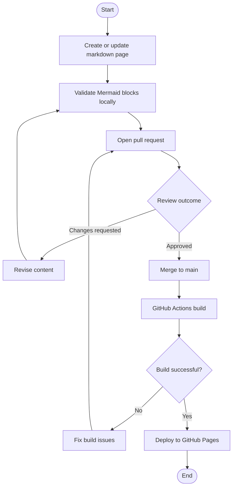

# Activity Diagram

This diagram captures the flow for publishing a documentation update.

## Operational notes

- Keep each step deterministic and repeatable.
- Fail fast at build time for broken links and invalid markdown.
