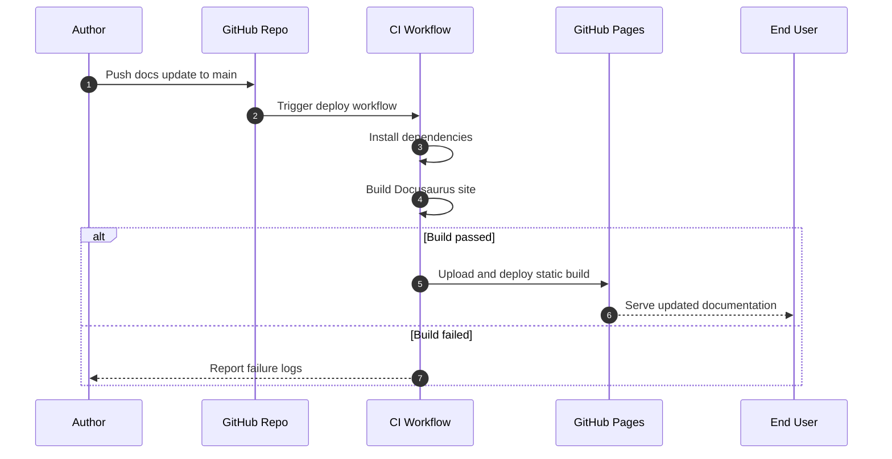

# Sequence Diagram

This sequence shows how a documentation publish request propagates through source control and deployment.

## Why this matters

- The sequence makes dependencies between authoring and deployment explicit.
- Failure branches identify where to add alerting and remediation steps.
