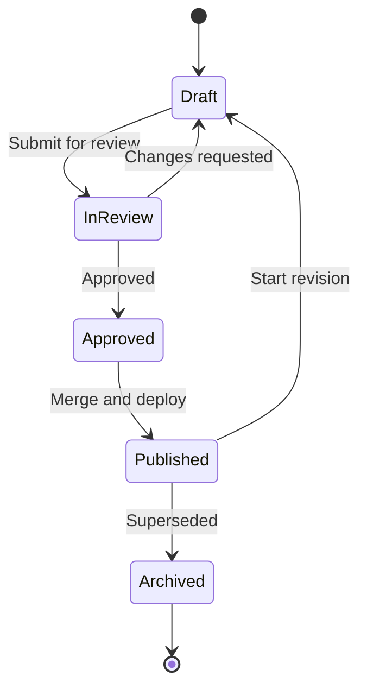

# State Machine Diagram

This model tracks the lifecycle of a documentation version.

## Usage

- Keep state names short and unambiguous.
- Define transition triggers as concrete actions.
- Mirror these states in workflows and automation where possible.
