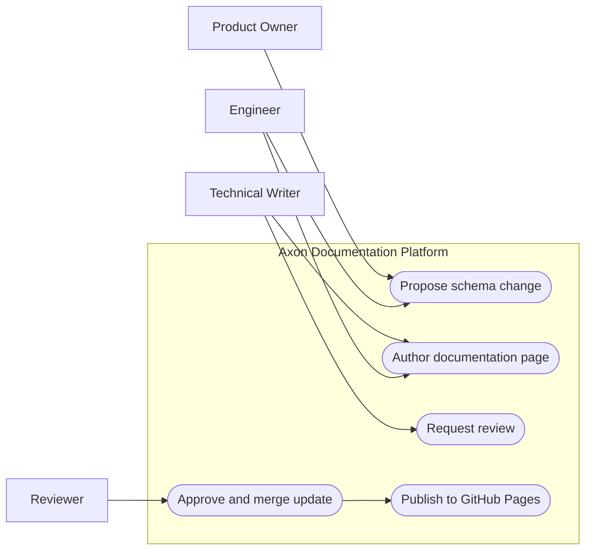

# Use Case Diagram

Mermaid does not have a native use case diagram type, so this model uses a flowchart to represent actors and system capabilities.

## Modeling guidance

- Actors stay outside the system boundary.
- Use naming patterns like verb plus noun for each use case.
- Keep this diagram high-level and move details to activity or sequence diagrams.
