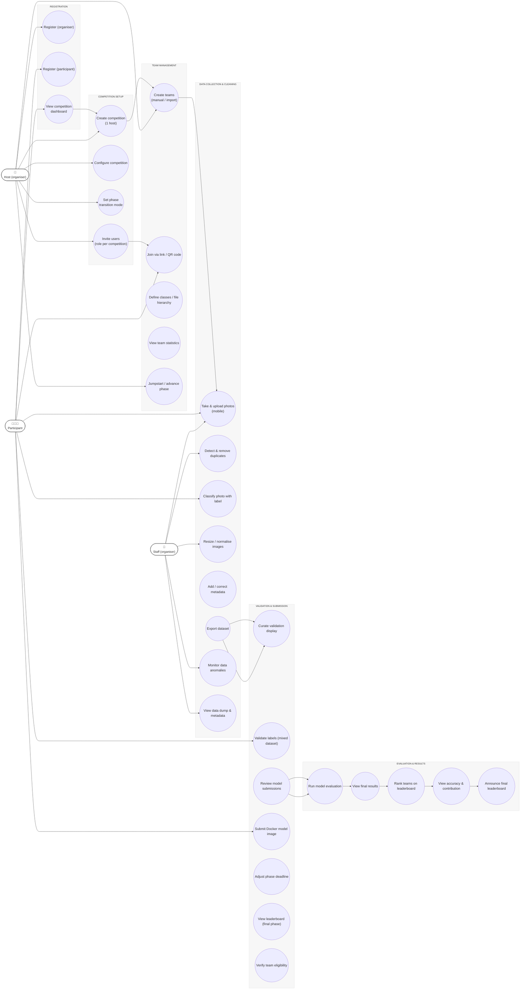

# Use Case Diagram

This page reproduces the use-case PNG at `static/diagrams/diagram.usecase.jpg` as a source-controlled Mermaid diagram. Read the diagram top-to-bottom: actors are on the left (Host, Staff) and right (Participant); the middle column groups use cases into functional areas (Registration, Competition setup, Team management, Data collection & cleaning, Validation & submission, Evaluation & results).

Use the Mermaid source below as the canonical representation — update it when the process or responsibilities change.

## Modeling guidance

- Actors are listed as simple labeled nodes for clarity; the diagram focuses on use-case grouping rather than detailed actor notation.
- Keep use-case labels short and action-oriented; use `\\n` inside quoted node text to create line breaks when necessary.
- Commit the Mermaid source as the canonical diagram and only regenerate PNGs when the source changes.
- Add small explanatory text and Operational notes for accessibility and discoverability.

## Operational notes

- Group responsibilities into functional areas (Registration, Setup, Team management, Data, Validation, Evaluation) to make ownership clear.
- Prefer one use case per oval; if a step grows complex, break it into smaller use cases and refer to them from the activity or sequence diagrams.
- Use the same authoring patterns as other docs: quoted labels for multi-line nodes, keep `classDef` inside the code fence, and test locally with `npm run start` or `npm run build`.
- When adding new pages, update `sidebars.ts` (or use an autogenerated sidebar) to avoid broken links during CI builds.
