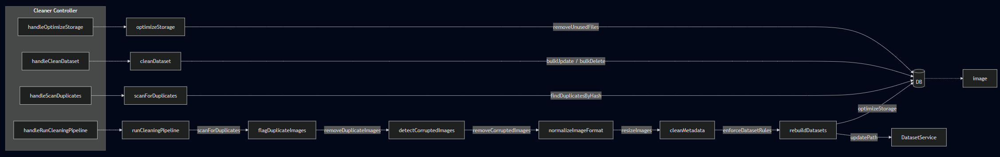

# Module Breakdown - cleaner

## Overview

The Cleaner System maintains dataset integrity across competitions by automating deduplication, corruption detection, format normalization, metadata sanitization, and storage optimization. It operates at both the competition and team level, and coordinates with the Dataset service to rebuild affected datasets after cleaning runs.

## Example Module Structure

### Responsibility

Runs configurable cleaning pipelines against competition image sets, identifying and removing duplicates (via hash comparison), corrupted files, and policy violations (missing labels, invalid formats, imbalanced datasets). Normalizes image formats and sizes, strips sensitive metadata, and triggers dataset reconstruction and storage cleanup on completion.

### Inputs / Outputs

**Controllers**
- `handleRunCleaningPipeline()`
- `handleScanDuplicates()`
- `handleCleanDataset(teamId)`
- `handleOptimizeStorage()`

**Services**
- `runCleaningPipeline(compId)`
  - → `scanForDuplicates(compId)`
  - → `flagDuplicateImages(duplicates)`
  - → `removeDuplicateImages(duplicates)`
  - → `detectCorruptedImages(compId)`
  - → `removeCorruptedImages()`
  - → `normalizeImageFormat(compId)`
  - → `resizeImages(compId)`
  - → `cleanMetadata(compId)`
  - → `enforceDatasetRules(compId)`
  - → `rebuildDatasets(compId)`
  - → `optimizeStorage()`
- `scanForDuplicates(compId)`
- `getDuplicateCandidates(images)`
- `compareHashes()`
- `flagDuplicateImages(duplicates)`
- `removeDuplicateImages(duplicates)`
- `detectCorruptedImages(compId)`
- `removeCorruptedImages()`
- `normalizeImageFormat(compId)`
- `resizeImages(compId)`
- `compressImages(compId)`
- `cleanMetadata(compId)`
- `removeSensitiveMetadata(imageId)`
- `enforceDatasetRules(compId)`
  - → `checkMissingLabels()`
  - → `checkInvalidFormats()`
  - → `checkDatasetBalance()`
- `rebuildDatasets(compId)`
  - → calls `DatasetService.updatePath()`
- `optimizeStorage()`
  - → `removeUnusedFiles()`
  - → `compressOldData()`

**Repository**
- `findImagesByCompetition(compId)`
- `findDuplicatesByHash(hash)`
- `findCorruptedImages()`
- `findUnlabeledImages(compId)`
- `updateImageStatus(imageId, status)`
- `deleteImage(imageId)`
- `bulkUpdate(images)`
- `bulkDelete(images)`

### APIs

#### `POST /competitions/:compId/cleaner/run`
**Description:** Run the full cleaning pipeline  
**Auth:** true  
**Role:** host\|staff

| Field | Type | Required | Description |
|---|---|---|---|
| `:compId` | integer path | ✅ | Competition ID |

**Output:** `duplicates_removed`, `corrupted_removed`, `images_normalized`, `images_resized`, `datasets_rebuilt` (boolean), `storage_freed_mb`, `completed_at`

---

#### `POST /competitions/:compId/cleaner/scan-duplicates`
**Description:** Scan for duplicate images without removing them  
**Auth:** true  
**Role:** host\|staff

| Field | Type | Required | Description |
|---|---|---|---|
| `:compId` | integer path | ✅ | Competition ID |

**Output:** `duplicate_groups` (`{ hash: string, image_ids: integer[] }[]`), `total_duplicates`

---

#### `POST /teams/:teamId/cleaner/clean`
**Description:** Run cleaning for a specific team's dataset  
**Auth:** true  
**Role:** host\|staff

| Field | Type | Required | Description |
|---|---|---|---|
| `:teamId` | integer path | ✅ | Team ID |

**Output:** `images_processed`, `issues_found` (string[])

---

#### `POST /competitions/:compId/cleaner/optimize-storage`
**Description:** Optimize storage for a competition  
**Auth:** true  
**Role:** host

| Field | Type | Required | Description |
|---|---|---|---|
| `:compId` | integer path | ✅ | Competition ID |

**Output:** `freed_mb`, `files_removed`, `completed_at`

### Dependencies

- **DatasetService** — `updatePath()` called during dataset rebuild after cleaning
- **Image Module repository** — for reading and mutating image records in bulk
- **Storage service** — for file-level removal and compression
- **Auth middleware** — for request authentication and role enforcement