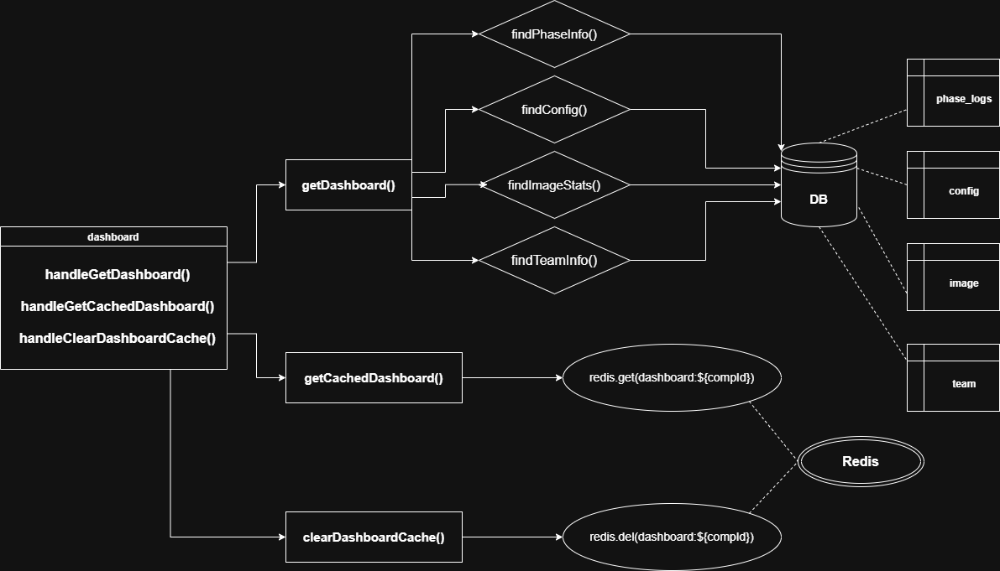

# Dashboard

## Overview

Passive read module that aggregates competition state from multiple tables and returns a unified dashboard view. Supports Redis caching to avoid redundant queries on frequent loads.

---

### Responsibility
No writes to the DB. Every time the dashboard is requested fresh, it pulls from 4 tables and saves the result to Redis. The host can clear the cache at any time to force a fresh computation.

### Inputs / Outputs

| Function | Input | Output |
|---|---|---|
| `getDashboard` | `compId` | `{ phase_info, config, image_stats, team_info }` |
| `getCachedDashboard` | `compId` | `{ cached_at, data }` |
| `clearDashboardCache` | `compId` | `{ cleared: true }` |

### APIs

**Endpoints**
- `GET    /competitions/:compId/dashboard` — Returns full dashboard: phase info, config, image stats (total/verified/on-hold), team info
- `GET    /competitions/:compId/dashboard/cache` — Returns a previously cached version of the dashboard with its timestamp
- `DELETE /competitions/:compId/dashboard/cache` — Clears the cached dashboard, forcing a fresh computation on next load — host only

**Controller**
- `handleGetDashboard(compId)`
- `handleGetCachedDashboard(compId)`
- `handleClearDashboardCache(compId)`

**Service**
- `getDashboard(compId)`
  - → `findPhaseInfo(compId)`
  - → `findConfig(compId)`
  - → `findImageStats(compId)`
  - → `findTeamInfo(compId)`
  - → save result to Redis `dashboard:${compId}`
  - → return data
- `getCachedDashboard(compId)` → `redis.get(dashboard:${compId})` → return `{ cached_at, data }`
- `clearDashboardCache(compId)` → `redis.del(dashboard:${compId})` → return `{ cleared: true }`

**Repository**
- `findPhaseInfo(compId)` — reads from `phase_log`
- `findConfig(compId)` — reads from `config`
- `findImageStats(compId)` — counts total / verified / on-hold from `image`
- `findTeamInfo(compId)` — reads from `team`

### Dependencies
- `phase_log`, `config`, `image`, `team` tables
- Redis (cache read/write/delete — no repo layer involved)
