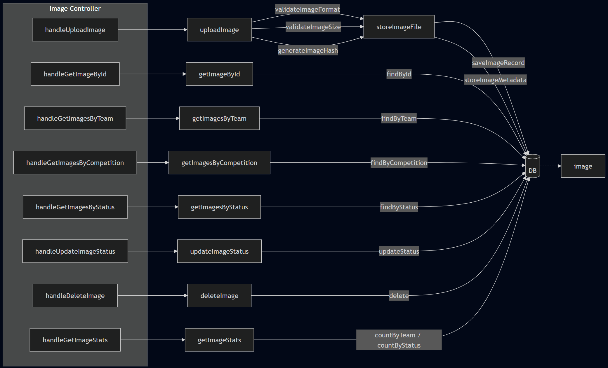

# Image

## Overview

The Image Module handles all lifecycle operations for competition images: uploading, retrieving, filtering, status management, and deletion. It enforces format and size validation, deduplication via hashing, and metadata extraction at upload time. Access is scoped by team and competition, with role-based restrictions on status updates and deletions.

## Example Module Structure

### Responsibility

Manages image upload and storage, enforces validation rules (format, size, duplicates), extracts and stores metadata, and exposes retrieval and filtering capabilities by team, competition, and status. Also provides aggregated image statistics per competition.

### Inputs / Outputs

**Controllers**
- `handleUploadImage()`
- `handleGetImageById()`
- `handleGetImagesByTeam()`
- `handleGetImagesByCompetition()`
- `handleGetImagesByStatus()`
- `handleUpdateImageStatus()`
- `handleDeleteImage()`
- `handleGetImageStats()`

**Services**
- `uploadImage(userId, teamId, file)`
  - → `validateImageFormat(file)`
  - → `validateImageSize(file)`
  - → `generateImageHash(file)`
  - → `checkDuplicateImage(hash)`
  - → `storeImageFile(file)`
  - → `saveImageRecord(userId, teamId, filepath, hash)`
  - → `extractMetadata(file)`
  - → `storeImageMetadata(imageId, metadata)`
- `getImageById(imageId)`
- `getImagesByTeam(teamId)`
- `getImagesByCompetition(compId)`
- `getImagesByStatus(status)`
- `updateImageStatus(imageId, status)`
  - → (optional) trigger validation workflow
- `deleteImage(imageId)`
  - → `deleteMetadata(imageId)`
  - → `deleteFile(filepath)`
- `getImageStats(compId)`
- `getTeamImageStats(teamId)`
- `validateImageFormat(file)`
- `validateImageSize(file)`
- `generateImageHash(file)`
- `checkDuplicateImage(hash)`

**Repository**
- `create(data)`
- `findById(imageId)`
- `findByHash(hash)`
- `findByTeam(teamId)`
- `findByCompetition(compId)`
- `findByStatus(status)`
- `updateStatus(imageId, status)`
- `delete(imageId)`
- `countByTeam(teamId)`
- `countByStatus(status)`

### APIs

#### `POST /teams/:teamId/images`
**Description:** Upload an image  
**Auth:** true

| Field | Type | Required | Description |
|---|---|----------|---|
| `file` | multipart/file | yes      | Image binary |
| `label` | string | no       | Optional label |

**Output:** `id`, `filepath`, `image_hash`, `status` (onhold\|verified), `metadata` (ImageMetadata)

---

#### `GET /images/:id`
**Description:** Get image by ID  
**Auth:** true

| Field | Type | Required | Description |
|---|---|----------|---|
| `:id` | integer path | yes      | Image ID (Integer PK) |

**Output:** `id`, `team_id`, `author_id`, `filepath`, `label`, `status` (onhold\|verified), `metadata` (ImageMetadata)

---

#### `GET /teams/:teamId/images`
**Description:** List images for a team  
**Auth:** true

| Field | Type | Required | Description |
|---|---|----------|---|
| `:teamId` | integer path | yes      | Team ID |
| `status` | enum query | no       | Filter by status |
| `page` | integer query | no       | Pagination |

**Output:** `images` (Image[]), `total`, `page`

---

#### `GET /competitions/:compId/images`
**Description:** List all images in a competition  
**Auth:** true

| Field | Type | Required | Description |
|---|---|----------|---|
| `:compId` | integer path | yes      | Competition ID |
| `status` | enum query | no       | Filter by status |

**Output:** `images` (Image[]), `total`

---

#### `PATCH /images/:id/status`
**Description:** Update image status  
**Auth:** true  
**Role:** staff\|host

| Field | Type | Required | Description |
|---|---|----------|---|
| `:id` | integer path | yes      | Image ID (Integer PK) |
| `status` | enum | yes      | onhold\|verified |

**Output:** `id`, `status`

---

#### `DELETE /images/:id`
**Description:** Delete an image  
**Auth:** true  
**Role:** staff\|host

| Field | Type | Required | Description |
|---|---|----------|---|
| `:id` | integer path | yes      | Image ID (Integer PK) |

**Output:** `message`

---

#### `GET /competitions/:compId/images/stats`
**Description:** Image statistics for a competition  
**Auth:** true

| Field | Type | Required | Description |
|---|---|----------|---|
| `:compId` | integer path | yes      | Competition ID |

**Output:** `total`, `by_status` (`{ onhold: int, verified: int }`), `by_team` (`{ team_id, count }[]`), `by_label` (`{ label, count }[]`)

### Dependencies

- **Storage service** — for persisting and deleting image files
- **Metadata service** — for extracting and storing image metadata
- **Hash utility** — for duplicate detection via content hashing
- **Auth middleware** — for request authentication and role enforcement