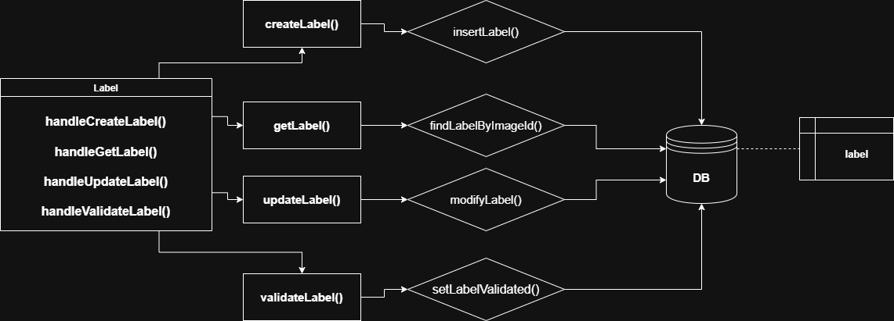

# Module Breakdown — Label

## Overview

Manages image labels submitted by teams throughout the competition. Each image starts with an unvalidated label. The Validation module calls `updateLabel` internally when a label is finalized via majority vote.

---

### Responsibility
Handles full CRUD on image labels. The `validateLabel` endpoint is restricted to staff and host. The `updateLabel` endpoint is also called internally by the Validation module — not just by external clients.

### Inputs / Outputs

| Function | Input | Output |
|---|---|---|
| `createLabel` | `imageId`, `label` | `{ id, image_id, label, validated: false }` |
| `getLabel` | `imageId` | `{ id, label, validated }` |
| `updateLabel` | `imageId`, `label` | `{ id, label, validated }` |
| `validateLabel` | `imageId` | `{ id, validated: true }` |

### APIs

**Endpoints**
- `POST   /images/:imageId/labels` — Creates a new label for an image — starts as unvalidated
- `GET    /images/:imageId/labels` — Retrieves the current label and its validation status for an image
- `PUT    /images/:imageId/labels` — Updates an existing label — also called internally by Validation when finalizing
- `POST   /images/:imageId/labels/validate` — Marks a label as validated — staff and host only

**Controller**
- `handleCreateLabel(imageId)`
- `handleGetLabel(imageId)`
- `handleUpdateLabel(imageId)`
- `handleValidateLabel(imageId)`

**Service**
- `createLabel(imageId, label)` → `insertLabel(imageId, label)`
- `getLabel(imageId)` → `findLabelByImageId(imageId)`
- `updateLabel(imageId, label)` → `modifyLabel(imageId, label)`
- `validateLabel(imageId)` → `setLabelValidated(imageId)`

**Repository**
- `insertLabel(imageId, label)`
- `findLabelByImageId(imageId)`
- `modifyLabel(imageId, label)`
- `setLabelValidated(imageId)`

### Dependencies
- `label` table
- Called externally by **Validation module** (`finalizeLabel` → `LabelService.updateLabel`)
