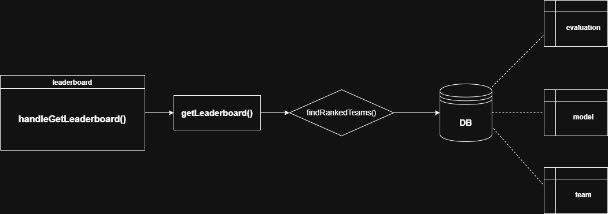

# Module Breakdown — Leaderboard

## Overview

Standalone read module that computes and returns team rankings from scores already stored in the DB. Displayed at the end of the competition. Rankings are computed on the fly every time the endpoint is called.

---

### Responsibility
No writes to the DB. Joins evaluation scores to teams and sorts them into a ranked list. The `limit` query param lets the caller cap how many entries are returned.

### Inputs / Outputs

| Function | Input | Output |
|---|---|---|
| `getLeaderboard` | `compId`, `limit` (optional) | `{ entries[ rank, team, score, submitted_at ], total_teams, last_updated }` |

### APIs

**Controller**
- `handleGetLeaderboard(compId)`

**Service**
- `getLeaderboard(compId, limit)` → `findRankedTeams(compId, limit)`

**Repository**
- `findRankedTeams(compId, limit)` — joins `evaluation → model → team`, sorted by score descending, assigns ranks

### Dependencies
- `evaluation`, `model`, `team` tables
