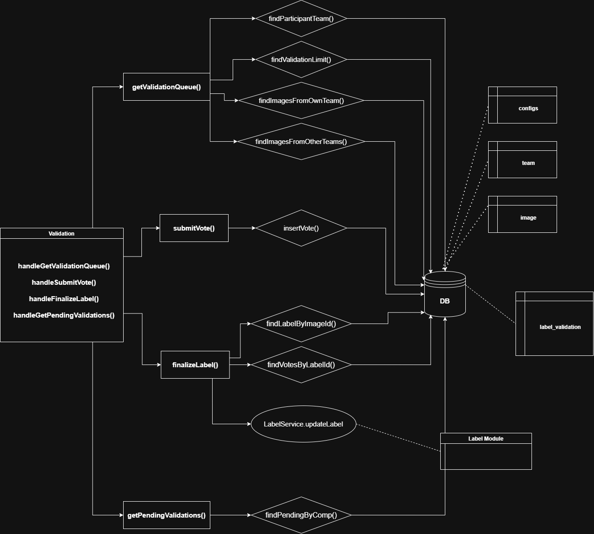

# Validation

## Overview

Handles the participant voting workflow for finalizing image labels. Each participant receives a batch of 10 images at a time to validate — approximately 60% from their own team and 40% from other teams, making the split invisible to them. The split is maintained dynamically across the participant's session by tracking their validation history. Once enough votes are collected, `finalizeLabel` computes the majority vote and persists the result via the Label module.

---

### Responsibility
Manages the full validation lifecycle: batch image distribution, vote submission, and label finalization. The 60/40 split is enforced dynamically at the service level per batch. Images that have reached the maximum vote threshold are excluded from the batch. Minor threshold exceed of 1-2 votes is acceptable due to concurrent batching. Cross-module dependency on Label for persisting finalized results.

### Inputs / Outputs

| Function | Input | Output |
|---|---|---|
| `getValidationBatch` | `compId`, `participantId` | `{ images[ id, filepath ], total }` |
| `submitVote` | `imageId`, `validatorId`, `label` | `{ validation_id, label }` |
| `finalizeLabel` | `imageId` | `{ label_id, final_label, total_votes }` |
| `getPendingValidations` | `compId` | `{ images[ ], total }` |

### APIs

**Endpoints**
- `GET    /competitions/:compId/validations/batch` — Returns a batch of 10 images for a participant to validate — respects 60/40 split and threshold cap
- `POST   /images/:imageId/validations` — Participant submits a validation vote for an image with their chosen label
- `POST   /images/:imageId/finalizeLabel` — Computes the final label from all votes via majority logic, then calls Label PUT to update
- `GET    /competitions/:compId/validations/pending` — Returns all images still pending final validation

**Controller**
- `handleGetValidationBatch(compId, participantId)`
- `handleSubmitVote(imageId)`
- `handleFinalizeLabel(imageId)`
- `handleGetPendingValidations(compId)`

**Service**
- `getValidationBatch(compId, participantId)`
  - → `findParticipantTeam(compId, participantId)`
  - → `findValidationThreshold(compId)` — reads max votes per image from `config`
  - → `countParticipantValidations(participantId)` — gets `ownCount` & `otherCount` from `label_validations`
  - → decide 60/40 split counts per batch (pure logic, no DB) — 6 from own team, 4 from others
  - → `findBatchFromOwnTeam(compId, teamId, participantId, threshold, count60)`
  - → `findBatchFromOtherTeams(compId, teamId, participantId, threshold, count40)`
  - → merge & return batch of 10
- `submitVote(imageId, validatorId, label)` → `insertVote(imageId, validatorId, label)`
- `finalizeLabel(imageId)`
  - → `findLabelByImageId(imageId)`
  - → `findVotesByLabelId(labelId)`
  - → `computeMajorityVote(votes)` — pure logic, no DB
  - → `LabelService.updateLabel(imageId, finalLabel)`
- `getPendingValidations(compId)` → `findPendingByComp(compId)`

**Repository**
- `findParticipantTeam(compId, participantId)`
- `findValidationThreshold(compId)` — reads from `config`
- `countParticipantValidations(participantId)` — counts own team vs other teams validations from `label_validations`
- `findBatchFromOwnTeam(compId, teamId, participantId, threshold, count)` — excludes already voted by participant + images at threshold cap
- `findBatchFromOtherTeams(compId, teamId, participantId, threshold, count)` — same exclusion logic
- `insertVote(imageId, validatorId, label)`
- `findLabelByImageId(imageId)`
- `findVotesByLabelId(labelId)`
- `findPendingByComp(compId)`

### Dependencies
- `label`, `label_validations`, `image`, `team`, `config` tables
- **Label module** — `finalizeLabel` calls `LabelService.updateLabel` directly to persist the majority vote result