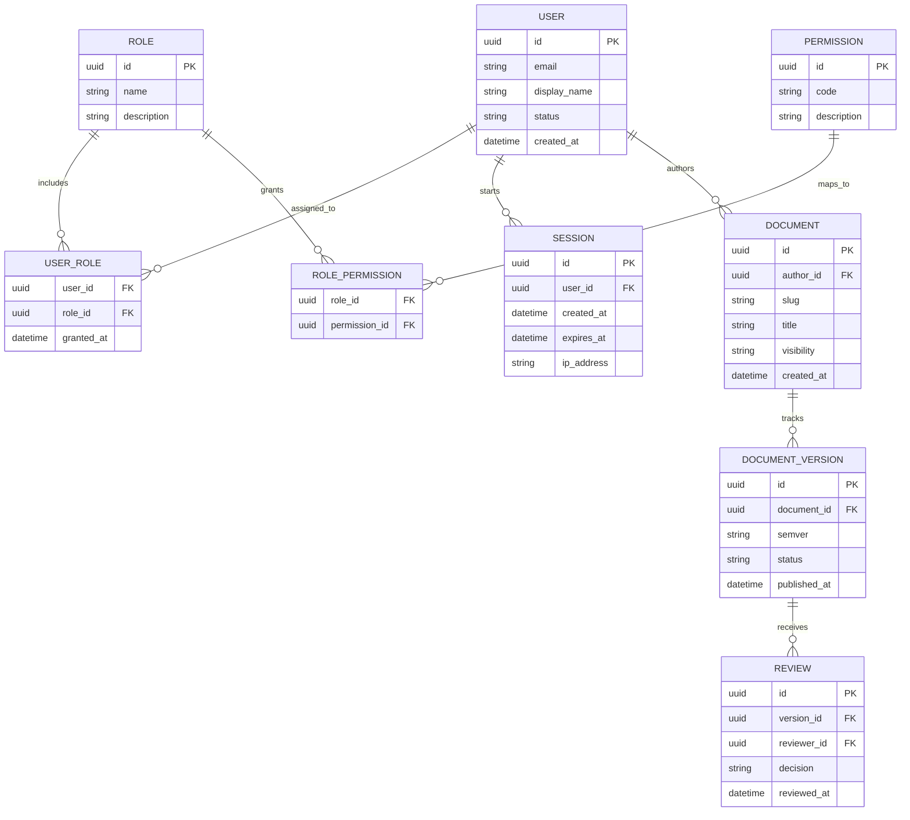

# Database Schema

The following ER diagram models core identity, authorization, and documentation lifecycle records.

## Notes

- Treat this as a living schema contract.
- Keep entity names aligned with actual table names in migrations.
- Add indexes and uniqueness rules in implementation notes as needed.
