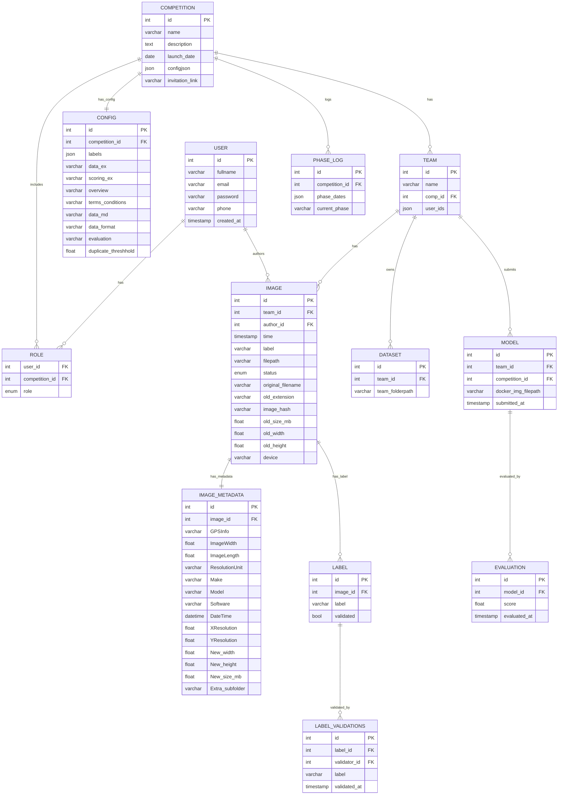

# Database Schema

This ER diagram is generated to match the canonical DBML in `static/schema/schema.db.txt` (source-controlled). It reflects core tables used by competitions, teams, images, labels, models and evaluations.

## Notes

- Treat this as a living schema contract.
- Keep entity names aligned with actual table names in migrations.
- Add indexes and uniqueness rules in implementation notes as needed.
