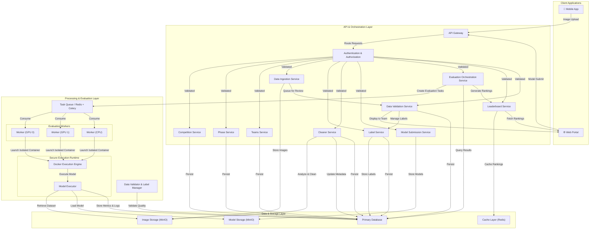

# Architecture Overview

Axon is designed as a modular, scalable platform to handle end-to-end data-centric AI competition workflows. The architecture follows a **layered approach** with clear separation between client applications, API services, processing layers, and data persistence.

## Architecture Diagram



## System Components

### 1. **Client Layer**

#### Mobile Application
- **Purpose:** Field data collection from agricultural environments
- **Responsibilities:**
  - Capture images with device metadata (camera model, sensors)
  - Collect environmental metadata (GPS, timestamp, weather conditions)
  - Automatic metadata pre-filling to ensure data quality
  - Direct upload to backend with offline queueing support
- **Technology:** Flutter/Dart (iOS/Android cross-platform)
- **Features:** Native performance, Hive local storage for offline queue, image picker integration
- **API Interactions:** Image upload endpoint, metadata validation, progress tracking

#### Web Portal
- **Purpose:** Model submission and competition management interface
- **Responsibilities:**
  - Team registration and profile management
  - Model file upload
  - Real-time leaderboard visualization
  - Cross-team validation protocol selection
  - Data validation interface for teams
  - Administrative dashboards for hosts and staff
- **Technologies:** Flutter Web/Dart (Unified with mobile, 70%+ code reuse)
- **API Interactions:** Model submission, leaderboard queries, team management, data validation

### 2. **API & Orchestration Layer**

#### API Gateway
- **Purpose:** Single entry point for all client requests
- **Responsibilities:**
  - Request routing to appropriate services
  - Rate limiting and throttling
  - Request/response logging and monitoring
  - CORS handling
- **Technology:** FastAPI (built-in gateway with middleware)
- **Protocol:** REST

#### Authentication & Authorization Service
- **Purpose:** Secure access control
- **Responsibilities:**
  - User authentication (JWT tokens)
  - Role-based access control (RBAC): Hosts, Staff, Participants
  - Token management and refresh
  - Audit logging for security events
- **Technology:** FastAPI + Python-Jose JWT (custom implementation)
- **Password Hashing:** PBKDF2-SHA256 (see `core/security.py`)
- **Roles:**
  - **Hosts (Organizers):** Full platform configuration and competition management
  - **Staff:** Data quality monitoring, team approvals, moderation
  - **Participants:** Data submission and model management

#### Competition Service
- **Purpose:** Manage competition lifecycle and configuration
- **Responsibilities:**
  - Create and configure competitions
  - Manage competition protocols and parameters
  - Update and delete competitions
  - Store competition metadata and configuration
- **Access Control:** Host role only for create, update, delete operations
- **Data Model:** Competitions, competition configuration

#### Phase Service
- **Purpose:** Manage competition phase lifecycle and transitions
- **Responsibilities:**
  - Track current competition phase (creation → active → evaluation → complete)
  - Handle automatic and manual phase transitions
  - Adjust phase deadlines as needed
  - Configure transition mode (automatic or manual)
  - Maintain immutable audit logs of all phase changes
  - Support manual phase overrides with documented reasons
  - Handle backward transitions when needed
- **Access Control:** Host role only for phase transitions and deadline adjustments
- **Data Model:** Phases, phase transition config, phase audit logs

#### Teams Service
- **Purpose:** Manage competition participants
- **Responsibilities:**
  - Team registration and profile management
  - Member management within teams
  - Team metadata storage (organization, contact info, etc.)
  - Participation tracking across competition seasons
- **Data Model:** Teams, team members, team metadata

#### Data Ingestion Service
- **Purpose:** Manage field image data collection
- **Responsibilities:**
  - Receive image uploads from mobile app
  - Validate metadata completeness and format
  - Store images in distributed file storage
  - Track image lineage and versioning
  - Ensure standardized format and resolution
  - Queue images for team validation
- **Validation Rules:**
  - Device information completeness (no metadata loss)
  - Image format standardization (JPEG/PNG)
  - Resolution requirements
  - Timestamp consistency

#### Label Service
- **Purpose:** Manage image labels throughout competition lifecycle
- **Responsibilities:**
  - Create initial (unvalidated) labels for images
  - Retrieve label information by image
  - Update labels (called by teams and Validation module)
  - Validate labels (restrict to staff/host)
  - Track label validation status and history
  - Support label corrections and feedback
  - Ensure label-image integrity
- **Access Control:** 
  - All authenticated users can create/read/update labels
  - Staff and hosts only can validate labels
- **Integration:** Called by Data Validation Service and Validation module
- **Data Model:** Labels, label validation status, label history

#### Cleaner Service
- **Purpose:** Maintain dataset integrity through automated cleaning and deduplication
- **Responsibilities:**
  - Detect and remove duplicate images (via hash comparison)
  - Identify and flag corrupted files
  - Normalize image formats and sizes
  - Sanitize metadata (remove sensitive information)
  - Enforce dataset quality rules (missing labels, invalid formats, imbalance)
  - Optimize storage (compression, removal of unused files)
  - Generate cleaning reports and statistics
  - Rebuild affected datasets after cleaning operations
- **Access Control:** Host and staff roles only
- **Operation Levels:** Competition-wide and team-level cleaning
- **Integration:** Works with Image module, updates database metadata
- **Data Model:** Cleaning jobs, duplicate groups, cleaning reports

#### Data Validation Service
- **Purpose:** Enable teams to review and correct image labels
- **Responsibilities:**
  - Display collected images to respective teams with initial labels
  - Provide intuitive UI for label review and correction
  - Coordinate voting workflow for label finalization
  - Ensure validation deadlines are respected
  - Generate validation completion reports
  - Call Label Service to persist label updates
- **Workflow:**
  - System automatically assigns images to collecting team
  - Team reviews images and associated labels
  - Team confirms label accuracy or provides corrections
  - Delegates to Label Service for label updates
  - Validates and locks finalized labels for evaluation phase
  - Staff monitors validation completion rates
- **Integration:** Calls Label Service for all label CRUD operations
- **Output:** Validated, human-reviewed dataset ready for model evaluation

#### Model Submission Service
- **Purpose:** Handle participant model submissions
- **Responsibilities:**
  - Receive model files from teams
  - Validate model format and structure
  - Store model versions
  - Track submission timestamps and versioning
  - Schedule model for evaluation
- **Supported Formats:** Standard model files compatible with evaluation framework

#### Evaluation Orchestration Service
- **Purpose:** Coordinate model evaluation across multiple protocols
- **Responsibilities:**
  - Schedule evaluations based on protocol type (LOTO, TOTO, standard fold)
  - Distribute evaluation tasks to worker queue
  - Track evaluation progress and status
  - Aggregate results from multiple evaluation runs
  - Handle failed evaluations with retry logic
- **Protocols:**
  - **Standard K-Fold:** Train on k-1 folds, test on fold k
  - **LOTO (Leave-One-Team-Out):** Generalization across teams (test on unseen team domain)
  - **TOTO (Train-On-One-Team-Only):** Assess single team's data collection strategy

#### Leaderboard Service
- **Purpose:** Rank teams based on evaluation results
- **Responsibilities:**
  - Calculate team rankings from evaluation results
  - Handle tie-breaking logic
  - Maintain historical snapshots of leaderboards
  - Provide real-time updates to web portal
  - Cache leaderboard data for performance
  - Support multi-protocol leaderboard views

### 3. **Processing & Evaluation Layer**

#### Task Queue / Message Broker
- **Purpose:** Decouple request processing from long-running evaluation tasks
- **Responsibilities:**
  - Accept evaluation tasks from orchestration service (one task per fold)
  - Ensure reliable task delivery and retry logic
  - Distribute tasks round-robin across all workers (Celery handles this)
  - Maintain job status and history
- **Technology:** Redis + Celery
- **Alternative (for school servers):** Database polling with status column (no Redis dependency)
- **Rationale:** The only task type is model inference on test data. No GPU/CPU scheduling needed — every worker runs the same kind of task. Celery's built-in round-robin is sufficient.

#### Evaluation Workers
- **Purpose:** Execute model evaluations in parallel
- **Responsibilities:**
  - Consume evaluation tasks from queue (Celery — one task per fold)
  - Fetch model and dataset for evaluation
  - Launch Docker container with model inference
  - Collect prediction results and metrics (accuracy, precision, recall, F1)
  - Report results back to database with status updates
- **Technology:** Python processes with Celery workers
- **Scalability:** Horizontally scalable — start N workers on the same machine or across servers. Each worker is pinned to one GPU (if available) or runs on CPU.
- **Single Task Type:** The only task is model inference on test data. No scheduler needed — Celery distributes tasks round-robin. Workers auto-detect GPU or fall back to CPU.
- **Hardfloor:** `worker_concurrency` = GPU count (preferred) or CPU core count

#### Data Validator & Label Manager
- **Purpose:** Manage data quality and team label validations
- **Responsibilities:**
  - Pre-process images before evaluation
  - Check image format and integrity
  - Verify file structure before processing
  - Manage label validation workflows
  - Track which labels have been validated by teams
  - Generate data quality reports
  - Flag inconsistencies for manual review

#### Model Executor
- **Purpose:** Execute model inference safely and efficiently
- **Responsibilities:**
  - Load model from storage
  - Prepare input data in correct format
  - Execute inference with specified hardware (CPU/GPU)
  - Capture predictions and confidence scores
  - Handle timeout and resource constraints
  - Log execution details for debugging

### 4. **Data & Storage Layer**

#### Primary Database
- **Purpose:** Store structured data and metadata
- **Core Entities:**
  - **Teams:** Competition participants (team_id, organization, metadata)
  - **Images:** Field images with metadata (image_id, team_id, device_info, resolution, storage_path)
  - **Models:** Participant submissions (model_id, team_id, framework, version, submission_date)
  - **Evaluations:** Model performance records (evaluation_id, model_id, dataset_fold, protocol_type, accuracy, timestamp)
  - **Leaderboards:** Real-time rankings (leaderboard_id, evaluation_fold, team_rankings, updated_at)
- **Technology:** PostgreSQL or similar RDBMS
- **Relationships:**
  ```
  Teams (1) ──→ (N) Images
  Teams (1) ──→ (N) Models
  Models (1) ──→ (N) Evaluations
  Evaluations → Leaderboards
  ```

#### Image Storage
- **Purpose:** Distributed storage for field images
- **Characteristics:**
  - High volume, immutable data
  - Access pattern: Write-once, read-many
  - Organize by team_id and timestamp for retrieval optimization
  - Support versioning and archival
- **Technology:** Object storage (AWS S3, Azure Blob, Google Cloud Storage)

#### Model Storage
- **Purpose:** Store submitted model files
- **Characteristics:**
  - Version control for each model submission
  - Enable model lineage tracking
  - Immutable storage for evaluation reproducibility
- **Technology:** Object storage with versioning enabled

#### Cache Layer
- **Purpose:** Reduce database load for frequently accessed data
- **Cached Data:**
  - Leaderboard snapshots
  - Team profile information
  - Evaluation metadata
  - Authentication tokens
- **Technology:** Redis or similar in-memory store
- **TTL:** Strategy depends on data freshness requirements

## Data Flow

### 1. **Image Collection & Ingestion Flow**
```
Participant (Field)
    ↓
Mobile App (Capture: image + device metadata)
    ↓
API Gateway (Authentication)
    ↓
Data Ingestion Service
    ├→ Validate metadata completeness
    ├→ Standardize format/resolution
    ↓
Image Storage (S3/Blob)
    ↓
Primary Database (Record metadata + storage path)
    ↓
Data Validation Service (Queue for team review)
```

### 2. **Data Validation & Label Correction Flow**
```
Data Validation Service
    ↓
Display to Team via Web Portal
    ├→ Show image + initial label
    ↓
Team Reviews & Corrects Labels
    ├→ Confirms label OR modifies it
    ↓
Store Validated Labels in Database
    ├→ Mark as validated
    ├→ Track corrections made
    ↓
Validated Dataset Ready for Evaluation
```

### 3. **Model Submission & Evaluation Flow**
```
Participant (Web Portal)
    ↓
Submit Model File + Metadata
    ↓
API Gateway (Authentication)
    ↓
Model Submission Service
    ├→ Validate model format
    ├→ Extract dependencies
    ↓
Model Storage (Versioned)
    ↓
Primary Database (Track submission)
    ↓
Evaluation Orchestration Service
    ├→ Determine evaluation protocol (LOTO/TOTO/K-Fold)
    ├→ Create evaluation tasks
    ↓
Task Queue (Message Broker)
    ↓
Evaluation Workers (Parallel execution)
    ├→ Load model from storage
    ├→ Fetch dataset fold
    ├→ Execute inference
    ├→ Collect metrics
    ↓
Primary Database (Store results)
    ↓
Leaderboard Service
    ├→ Calculate rankings
    ├→ Update cache
    ↓
Web Portal (Real-time update)
```
### 4. **Leaderboard Update Flow**
```
Evaluation Results Stored
    ↓
Leaderboard Service
    ├→ Query all team results
    ├→ Calculate rankings (by accuracy)
    ├→ Apply tie-breaking rules
    ├→ Generate historical snapshot
    ↓
Cache Layer (Redis)
    ↓
Web Portal (Fetch and display)
    ↓
Participants View Live Rankings
```

## Tech Stack Decisions

### Frontend (Web + Mobile)
- **Choice:** Flutter/Dart
- **Rationale:**
  - Single codebase for web, iOS, and Android (70%+ code reuse)
  - Type-safe, beginner-friendly language for students
  - Native performance on all platforms
  - Material Design UI framework built-in
  - Excellent for rapid development and learning

### Backend API Framework
- **Choice:** FastAPI (Python)
- **Rationale:**
  - Built-in API gateway, routing, and middleware
  - Native integration with ML/AI libraries (scikit-learn, PyTorch, TensorFlow)
  - Automatic API documentation (Swagger/OpenAPI)
  - High performance (faster than Django for APIs)
  - Easy for students to learn and extend
  - Excellent async/await support for long-running tasks

### Message Queue / Broker
- **Choice:** Redis + Celery (primary) or Database Polling (fallback)
- **Rationale:**
  - Celery: Standard Python task queue, easy scaling
  - Redis: In-memory broker, doubles as caching layer
  - Database Polling: Works without Redis if needed
  - Decouple long-running evaluations from API requests
  - Enable horizontal scaling of worker processes
  - Reliable job persistence and retry logic

### Evaluation Environment
- **Choice:** Docker containers for model execution
- **Workers:** Python processes with Celery
- **Rationale:**
  - Isolate model execution environments
  - Version control of dependencies per model
  - Support multiple frameworks (PyTorch, TensorFlow, scikit-learn)
  - GPU support via `docker run --gpus` flag (NVIDIA Container Toolkit)
  - Safe execution of untrusted user code
  - No scheduler needed — Celery distributes all tasks round-robin

### Database
- **Choice:** PostgreSQL with SQLAlchemy ORM
- **Rationale:**
  - ACID compliance for consistency
  - Strong JSON support for flexible metadata
  - Full-text search for team/image discovery
  - Proven performance at scale
  - Excellent Python integration via SQLAlchemy

### Caching
- **Choice:** Redis
- **Dual Purpose:** Task queue broker (Celery) + session/leaderboard caching
- **Rationale:**
  - Sub-millisecond read latency
  - Atomic operations for rankings
  - Pub/Sub for real-time updates
  - Single service eliminates complexity
  - Easy to deploy in school environment

### Object Storage (Images & Models)
- **Choice:** MinIO (self-hosted S3-compatible)
- **Development:** Local file system (instant, zero setup)
- **Production:** MinIO on school server (unlimited, free)
- **Alternative:** Supabase Storage (1GB free cloud tier)
- **Rationale:**
  - MinIO: Full control, no vendor lock-in, unlimited storage, zero egress costs
  - Local storage: Perfect for development, no dependencies
  - S3-compatible API: Easy to migrate later if needed
  - Cost-effective for school with large image/model datasets

### Deployment & Orchestration
- **Development:** Docker Compose (FastAPI + DB + Redis + MinIO + Workers)
- **Production:** Docker containers on school server or cloud
- **Scaling:** Multiple worker processes or containers
- **Rationale:**
  - Simple, understandable setup for students
  - All services run together in predictable environment
  - No Kubernetes complexity
  - Easy monitoring and debugging
  - Scalable from laptop to multiple servers

## Complete Tech Stack Summary

| Component | Technology | Purpose |
| :--- | :--- | :--- |
| **Frontend (Web + Mobile)** | Flutter/Dart | Single codebase for web, iOS, Android |
| **Backend API** | FastAPI (Python 3.10+) | REST API, all services in monolithic structure |
| **API Gateway** | FastAPI middleware | Built-in routing, rate limiting, CORS |
| **Authentication** | Custom JWT + FastAPI | Role-based access control (RBAC) |
| **Password Hashing** | PBKDF2-SHA256 | Secure password storage (see `core/security.py`) |
| **Database** | PostgreSQL + SQLAlchemy ORM | Structured data, ACID transactions |
| **Image Storage** | MinIO (S3-compatible) | Distributed object storage on school server |
| **Model Storage** | MinIO (S3-compatible) | Versioned model files for evaluations |
| **Task Queue** | Redis + Celery | Background job processing for evaluations |
| **Caching** | Redis | Session & leaderboard caching, Celery broker |
| **Evaluation Workers** | Python/Celery | Model evaluation execution, parallel processing |
| **Deployment** | Docker Compose | Container orchestration for development/production |

## Development Environment Setup

**What you need to install:**

1. **Docker + Docker Compose** - Runs all services (FastAPI, PostgreSQL, Redis, MinIO)
2. **Python 3.10+** - For local FastAPI development and worker testing
3. **Flutter SDK** - For frontend development
4. **Git** - Version control
5. **PostgreSQL client** (psql) - Optional, for direct database access

**That's it!** No Kubernetes, no RabbitMQ, no complex DevOps. Everything runs with:

```bash
docker-compose up
```

## Key Architectural Decisions

### Why This Stack?

1. **Single Language (Python)** - Backend, workers, and scripts all in Python for consistency
2. **Single Frontend (Flutter)** - Web + mobile from same codebase, 70% code reuse
3. **No Microservices** - Monolithic FastAPI for simplicity and fast development
4. **Self-Hosted Storage** - MinIO gives unlimited storage on school server (no cloud costs)
5. **Built-in Solutions** - FastAPI handles API gateway, JWT, routing (no separate tools)
6. **Simple Task Queue** - Celery + Redis, or fallback to database polling
7. **Docker-First** - Everything containerized and reproducible

### Why NOT These?

- ❌ Kubernetes - Too complex for school project
- ❌ Microservices - Overkill for fixed user count
- ❌ AWS/Azure - Cloud costs unnecessary with school hardware
- ❌ React/Next.js + Flutter - Would need 2 separate code bases
- ❌ RabbitMQ/Kafka - Redis + Celery is simpler
- ❌ Auth0/Supabase - Custom JWT gives full control, same complexity

## Scalability Path

If the project grows:

1. **Phase 1 (Now):** Monolith + local workers on a single machine
2. **Phase 2 (HPC):** Add more workers pinned to GPUs. Start workers with `--gpus device=N`. Same code, no changes needed.
3. **Phase 3 (Distributed):** Workers on separate servers + MinIO for shared model/dataset access. Redis on its own server.
4. **Phase 4 (Scale):** Kubernetes orchestration if needed (not before)

Each phase is backwards compatible — no rewrites needed.

## Key Architectural Principles

1. **Separation of Concerns:** Each service has a single, well-defined responsibility
2. **Scalability:** Stateless API services and horizontally scalable worker pool
3. **Reliability:** Message queue ensures no evaluation task is lost
4. **Data Quality First:** Validation at ingestion point, not downstream
5. **Asynchronous Processing:** UI-blocking operations handled via task queue
6. **Real-time Updates:** Cache layer and pub/sub for instant leaderboard updates
7. **Modularity:** Services can be developed, deployed, and scaled independently
